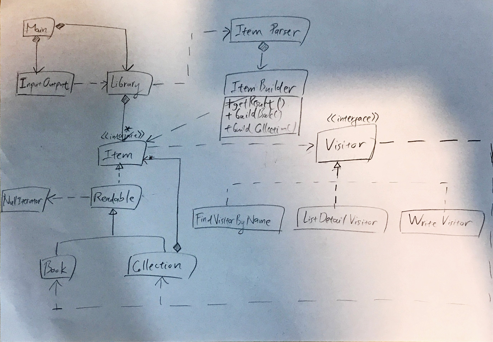

# Library Management System
## Description
This is the repository for the homeworks 2, 3, 4 and 5 of the course *Design Pattern* opened during the 2020 Spring Semester at the National Taipei University of Technology.

## Problem Description
You will have to program a library management system, whose SRS is specified below. Specifically, you must write the implementations and tests for the classes and their methods given in [this template project](
https://drive.google.com/open?id=1uAi8Wd2Kcv2cXnW61Sz_OpzsMnqQ_lw_) (only accessible to Gmail accounts of domain `ntut.org.tw`).

## Software Requirements Specification (SRS)
* The library management system can add an `Item` to the `Library`.
* An `Item` can be either a `Book` or a `Collection`.
* A `Book` should contain its name, description, author, and ISBN.
* A `Collection` should contain its name and description.
* A `Collection` can contain zero or many `Book`(s) and other `Collection`(s).
* An `Item` can ask a `FindVisitorByName` to help it find from itself and its children (if any) `Item`(s) having a specific name.
* An `Item` can ask a `ListDetailVisitor` to help it retrieve the information of itself and its children (if any). If the `Item` is a `Book`, then its name, description, author, and ISBN shall be retrieved. If the `Item` is a `Collection`, then its name, description, and the information of its children (if any) shall all be retrieved.
* The library management system can import from a `JSON` file a list of `Item`(s) to the `Library`. The library management system can also export the current `Item`(s) in the `Library` to a `JSON` file. Please refer to [test_data/sample_data.json](test_data/sample_data.json) for the format of the `JSON` file.
* An `ItemParser` can parse a `JSON Object` string and build an `Item` from it using an `ItemBuilder`.
* An `Item` can ask a `WriteVisitor` to accumulate the corresponding `JSON Object` representation of the `Item` to the result of the `WriteVisitor`, which is a `JSON Object` string. The forementioned `JSON Object` contains one single property named `itemlist`. The property value is a `JSON Array` whose items are the accumulated `JSON Object`(s) of `Item`(s) having accepted the `WriteVisitor`.
### `JSON Object` Representation of `Item`
#### `Book`
```
{
  "type": "book",
  "name": "Design Patterns",
  "description": "This is a book discuss about 23 patterns of software designs.",
  "author": "Erich Gamma, Richard Helm, Ralph Johnson, John Vlissides",
  "isbn": "0201633612"
}
```

#### `Collection`
```
{
  "type": "collection",
  "name": "Agile",
  "description": "This collection contains all books about agile.",
  "items": [
    {
      "type": "book",
      "name": "Learning Agile: Understanding Scrum, XP, Lean, and Kanban",
      "description": "Learning Agile is a comprehensive guide to the most popular agile methods, written in a light and engaging style that makes it easy for you to learn.",
      "author": "Andrew Stellman, Jennifer Greene",
      "isbn": "1449331920"
    }
  ]
}
```

## Execution
Please refer to [this execution example](docs/EXECUTION_EXAMPLE.md) on how to run the program.

## Design Patterns
The project implements the following design patterns:
* Composite
* Iterator
* Visitor
* Builder

## Class Diagram
Composed by [phogbinh](https://github.com/phogbinh).


## Contributor
* [phogbinh](https://github.com/phogbinh)